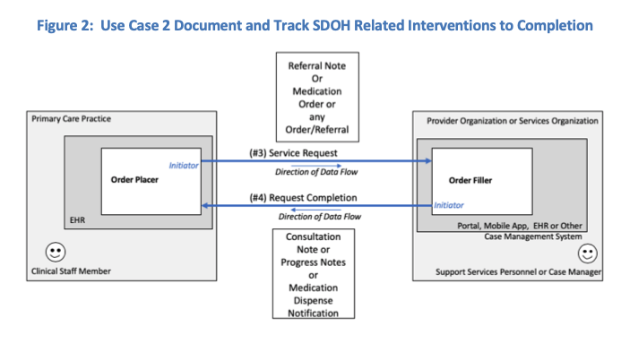

[Previous Page](Use_Case_1.html)

This use case is relevant for documenting actions planned or completed in response to data collected about social risks and social needs in electronic health information systems.  Actions can include counseling, education, consults, referrals, case management, care planning, and modifications to treatment. 

Transactions:
1.	Service Request
2.	Request Completion

To illustrate this use case, the role of Order Placer is filled by a Clinical Staff Member (see Table 4 below).  The Order Placer can be filled by other human actors to include the Patient and their proxy.  In this case, the Patient can use a mobile app, PHR, or patient portal to place the order and interact with the Order Filler.  

<table><tr><td></td></tr></table>

<table><tr><td></td></tr></table>

<table><tr><td></td></tr></table>

<table><tr><td></td></tr></table>

[Next Page](Use_Case_3.html)