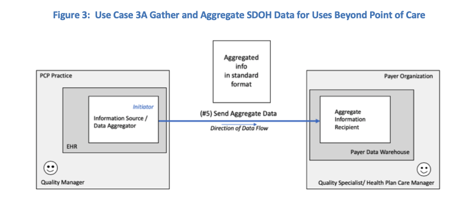
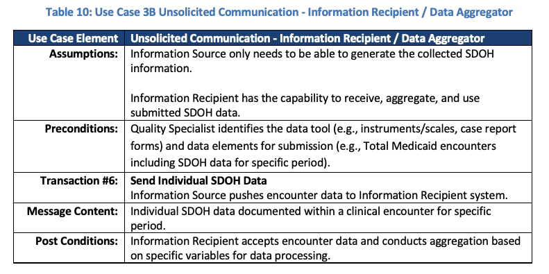

[Previous Page](Use_Case_2.html)

This use case describes how patient-level social risk information documented and shared in the above use cases can be aggregated and analyzed to support clinical, system, and community activities, including but not limited to panel and population health management, risk adjustment, value-based payment, and community health improvement. 

### Clinical and Payer Scenarios to Support Use Case 3

Population health management:  On a monthly basis, the Clinical Manager  at the Primary Care Practice reviews EHR data that includes social needs and related referrals.  Based on the data, the Clinical Manager sees that one social risk factor (food insecurity) is the most frequently reported social risk factor in their patient population.  The Clinical Manager notes that the goal of food security is rarely met when the only intervention completed is a referral to a local food pantry.
The Clinical Manager explores how to ensure social risk (food insecure) patients are consistently being referred to appropriate services and how to track whether those referrals are effective.

#### Quality reporting:  
The PCP Office is located in a state that recently began requiring providers to identify social risk factors among Medicaid patients on a quarterly basis and to refer patients with risks to appropriate resources. 

The Clinical Manager uses the EHR to generate quarterly reports that list the total number of patients screened and the total number of screened patients who were referred to services.  The reports are electronically submitted to the Payer (State Medicaid Agency or Managed Care Organization) on a quarterly basis.

#### Risk Adjustment and Risk Stratification:  
The Clinical Manager uses the EHR to generate annual reports that list the total number of patients screened and the outcomes of identified interventions for screened patients.  The report includes demographic information and information about the patients health concerns.  The Clinical Manager sends the report to the Payer. 

The Payer uses the report to stratify outcomes for members and to examine the impacts of social risks on outcomes for use in future risk adjustment.

### Use Case 3 Patterns and Transactions
Several use case patterns exist to support the use case 3 activities described above. For the purpose of this use case document, the following three patterns were identified to describe the transactions for sending aggregate SDOH data from one system to another.

#### Use Case Patterns:

3A:  Unsolicited Communication by Smart Sender.  This pattern describes transactions where the information source system has the capability to aggregate SDOH data and send the aggregated data to another system.  Refer to Tables 7 and 8 and Figure 3 below. 

3B:  Unsolicited Communication by Smart Receiver.  This pattern describes transactions where the recipient of the SDOH data performs the data aggregation.  Refer to Tables 9 and 10 and Figure 4 below.

3C:  Unsolicited Communication managed by Middle System.  This pattern describes transactions where a middleware system performs the data aggregation activity and sends the aggregated data to another system.  Examples of middle systems include clearinghouses, health information system providers (HISP), health information exchanges (HIE), or community information exchanges (CIE).  Refer to Tables 11 and 12 and Figure 5 below.

### Transactions:
1.	Send Aggregate SDOH Data
2.	Send Individual SDOH Data

To illustrate this use case, the role of information source/ data aggregator is filled by a Quality Manager (see Table 7, 9, and 11).  The information source/ data aggregator can be filled by other human actors to include the patient or their proxy.  In this case, the patient can use a mobile app, PHR, or patient portal to gather, aggregate, and send data to the Information Recipient.  

<table><tr><td></td></tr></table>

<table><tr><td></td></tr></table>

<table><tr><td></td></tr></table>

<table><tr><td></td></tr></table>

<table><tr><td></td></tr></table>

<table><tr><td></td></tr></table>

<table><tr><td></td></tr></table>

<table><tr><td></td></tr></table>

<table><tr><td></td></tr></table>

[Next Page](Patient_Story_1_Personas.html)