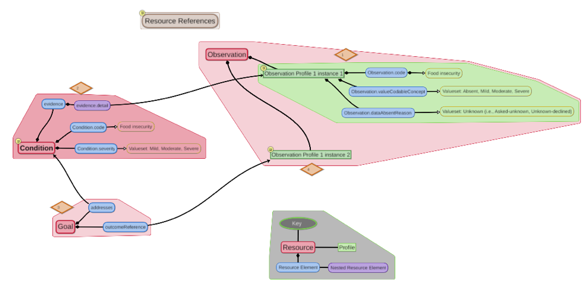
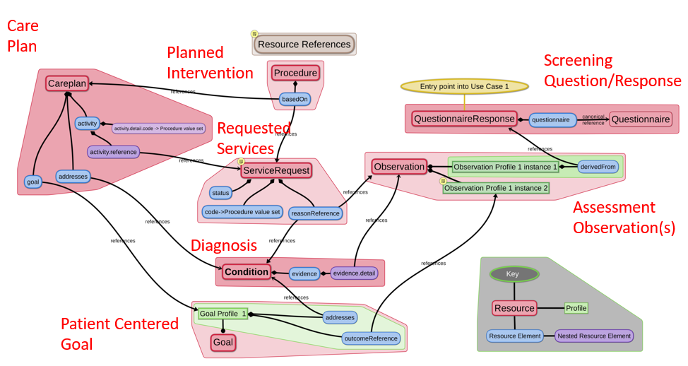

<!-- { :.no_toc } -->

<!-- TOC  the css styling for this is \pages\assets\css\project.css under 'markdown-toc'-->

* Do not remove this line (it will not be displayed)
{:toc}

<!-- end TOC -->

### Description

[Table of Contents](https://trifolia-fhir-dev.lantanagroup.com/igs/lantana_prod_hapi_r4/SDOH-CC/toc.html)

|**IG Realm:**         | **US**                                        |
|-------------------|--------------------------------------------|
|**IG Type:**           | **STU**                                         |
|**Exchange Methods:**  | **RESTful Query, Messaging, Documents, Tasks** |

**IG Dependencies**
This IG utilizes and adopts guidance developed in several other FHIR Implementation Guides. 

Additional information regarding the conformance to guidance developed in these IGs is available in the Overview of Data Sharing Transactions section and Capability Statement section of this IG.  

| IG Code                                                        | Implementation Guide Name          | Version                      |
|-----------------------------------------------------------------|------------------------------------|------------------------------|
| [US Core]( http://hl7.org/fhir/us/core/2019Sep/)           | HL7 FHIR US Core                  | Version 3.1.0 - FHIR R4      |
| [SDC]( http://build.fhir.org/ig/HL7/sdc/)                       | Structured Data Capture            | V3.0.2                       |
| [C-CDA on FHIR](https://build.fhir.org/ig/HL7/ccda-on-fhir-r4/) | C-CDA on FHIR R4                   | Version (1.1.0)              |
| [CDex](http://hl7.org/fhir/us/davinci-cdex/2019Jun/)            | DaVinci Clinical Data exchange | Version (1.0.0)              |
| [BSer](http://build.fhir.org/ig/HL7/bser/)                      | Bidirectional Services eReferrals  | Version (0.2.0) for FHIR R3  |
| [eCR](http://hl7.org/fhir/us/ecr/2018Sep/)                      | Electronic Case Reporting          |                              |
| [UV Bulk Data](http://hl7.org/fhir/uv/bulkdata/)              | FHIR Bulk Data Access (Flat FHIR)                   | Version (1.0.0) for FHIR 4.0 |

 
# Acknowledgements

Reserve this area to included acknowledgements for the people and organizations involved in developing and maintaining this Implementation Guide.

There may also be some required copyright acknowledgements for certain Code Systems or other acknowledgements required by HL7 and FHIR.

The Placeholder Code Creation process was originally developed for Elimu profiles and SMART app development. It was modified in the context of creating this IG to make it more broadly applicable.

 
#  Introduction
 
### IG Purpose
This HL7 IG defines FHIR R4 profiles, extensions and value sets needed to exchange SDOH content defined by the Gravity Project. It supports the following use cases:
1.	Document SDOH data in conjunction with the patient encounter,
2.	Document and track SDOH related interventions to completion,
3.	Gather and aggregate SDOH data for uses beyond the point of care (e.g. population health, quality reporting, risk adjustment/risk stratification, and research.
The IG defines how to represent coded content used to support the following care activities: screening, clinical assessment/diagnosis, goal setting, and the planning and performing of interventions. It addresses the need to gather SDOH information in the context of clinical encounters and describes how to share SDOH information and other relevant information with outside organizations for the purpose of coordinating services and support to address SDOH related needs, or for other purposes such as population health, quality assessment, and research.

 
### Note to Reviewers and Balloters

Review of version 0.0.1 of the IG is intended to gather high-level comments about the overall approach to the Implementation Guide and its positioning in terms of supporting the use cases defined for the Gravity Project. It also is aimed at identifying omissions that impact the quality of the IG.

Feedback on V0.0.1 of the IG should be sent to gravityproject@emiadvisors.net between December 12th 2019 and January 8, 2020.

 
###  How to Read This Guide

This Guide is divided into several pages which are listed at the top of each page in the menu bar.
* [TOC](https://trifolia-fhir-dev.lantanagroup.com/igs/lantana_prod_hapi_r4/SDOH-CC/toc.html): The TOC page lists the available pages for quick navigation to the available pages of content
* [Home](https://trifolia-fhir-dev.lantanagroup.com/igs/lantana_prod_hapi_r4/SDOH-CC/index.html): The home page contains the narrative implementer guidance that makes up this FHIR IG. It contains an introduction to the implementation guide and its background. It includes an overview of the use cases covered and summarizes the actors and transactions used to accomplish each use case. It also lists and briefly describes all the profiles, extensions and value sets defined in this IG as well as the other profiles used to accomplish the covered use cases but defined in other IGs.
* [Profiles and Extensions](https://trifolia-fhir-dev.lantanagroup.com/igs/lantana_prod_hapi_r4/SDOH-CC/profiles.html): This area of the IG describes the set of machine processable FHIR profiles and extension that are defined in this guide. These are profiles and extensions that have been specifically to exchange SDOH data defined for discrete representation through the Gravity Community collaboration process. Each Profile page includes a narrative introduction to explain the profile, a formal definition and a Quick Start guide to describe relevant mechanisms to query for the resource.
* [Terminology](https://trifolia-fhir-dev.lantanagroup.com/igs/lantana_prod_hapi_r4/SDOH-CC/terminology.html): This area of the IG describes the set of machine processable FHIR value set definitions for the value sets used in the profiles and extensions defined in this IG. It also holds machine processable value set definitions for value sets that may be used with profiles and extensions defined in other IGs. During development and testing of the Implementation guide, the value set definitions reference a placeholder code system that holds placeholder codes. Placeholder codes are temporary codes which exist solely for the purpose of development and testing. They are fully defined in terms of the intended Code System for their eventual representation and in terms of the specific representational definition required by that intended coded system. Placeholder codes evaporate prior to the IG being published.  They are replaced with real codes established by each Standards Development Organization (SDO) authorized to update the intended code systems.  The value set definitions also are updated prior to publication and the IG is updated to include links to the value set expansions intended to be used when implementing according to the specifications of the published IG.
* [Capability Statements](https://trifolia-fhir-dev.lantanagroup.com/igs/lantana_prod_hapi_r4/SDOH-CC/capstatements.html): This area of the IG describes the machine processable FHIR capability statements for each of the system actors identified in the use cases.
* [Other](https://trifolia-fhir-dev.lantanagroup.com/igs/lantana_prod_hapi_r4/SDOH-CC/other.html): This area of the IG contains explanations of and links to all the examples used in this guide.
* [Downloads](https://trifolia-fhir-dev.lantanagroup.com/igs/lantana_prod_hapi_r4/SDOH-CC/downloads.html): This page provides links to the downloadable machine processable artifacts described in the other areas of the IG.

 
### How to Use This Guide: Practical Guidance for Implementers at All Levels of Standards Adoption
This area is reserved for content being developed by Lisa and Corey. It will describe the following scenarios:
1.	Implementers who have already developed mechanisms for gathering and sharing (providing and receiving) SDOH related information and have systems in production use of this information today,
2.	Implementers who currently are developing new systems that gather and share SDOH related information and plan to deploy them within the next 12-18 months (before 2021).
3.	Implementers who currently do not gather or share SDOH information.
		a.	Implementers who gather and produce C-CDA documents to support sharing of clinical encounter or patient summary information but have not yet implemented FHIR application interfaces (APIs) or support for the use of FHIR APIs offered by other systems to facilitate the sharing of clinical information.
		b.	Implementers who gather clinical encounter or patient summary information but do not yet produce C-CDA documents to support sharing of that information and have not yet implemented FHIR application interfaces (APIs) or support for the use of FHIR APIs offered by other systems to facilitate the sharing of clinical information.

 

# Background
The influence of social determinants on health outcomes is increasingly recognized in emerging payment reform programs, federal and state-based policies, and information technology initiatives.  Social determinants of health (SDOH) are defined by the World Health Organization as the conditions in which people are born, live, work, and age.  

The growing awareness around SDOH has contributed to efforts to address actionable socioeconomic risk factors through the health care delivery system.  Recommendations from national groups, including the American Academy of Pediatrics , American Academy of Family Physicians , Agency for Healthcare Research and Quality , National Quality Forum (NQF),  and Institute for Health Care Improvement  underscore the various roles the health care system could play in helping to identify and reduce patients social risk factors. 

<table><tr><td></td></tr></table>
*Source: Institute for Clinical Systems Improvement, Going Beyond Clinical Walls: Solving Complex Problems (October 2014) Adapted from The Bridgespan Group*

These national calls to action for health care systems have spurred innovations, including a wide range of social risk screening tools and practice-based interventions.   Some of these innovations have helped to reduce social risks, improve health outcomes, and lower costs.   The experimentation in this area has been bolstered by new value-based payment models and accountable care organizations (ACOs), which together offer financial incentives to advance coordinated care between medical and social service organizations and other organizations directly connected to patients. 

Many of the recent innovations in this area begin with the strategic collection of SDOH data.  As examples, the Centers for Medicare & Medicaid Services Innovation Center (CMS Innovation Center) Comprehensive Primary Care Plus Model requires providers to assess patients social risks, and the CMS Innovation Centers Accountable Health Communities Model developed a social risk assessment tool to help identify and address social risks across clinical and community-based settings. 

These emerging initiatives to collect SDOH data in health care settings present new challenges for national goals to standardize patient data recorded in electronic health records (EHRs).   Two Health Information Technology for Economic and Clinical Health Act (HITECH) Programs require providers to use health IT systems that capture specific patient data in standardized formats to enable interoperable data exchange with other systems. 

These programs require that EHRs use a common clinical data set (CCDS), including specific medical codes, to represent concepts such as race, ethnicity, and preferred language, but they include limited requirements to represent social risk assessments and related social care interventions.  As an example, though the Office of the National Coordinator (ONC) 2015 Edition includes an optional certification criterion around Social, Psychological, and Behavioral Data, which helps to define codes for SDOH concepts based on the National Academy of Sciences, Engineering, and Medicine Recommended Social and Behavioral Domains and Measures, it does not reflect the wide range of social risk factors being collected in clinical settings. 

The capture and exchange of interoperable data allows providers to share specific information with health plan payers who seek to aggregate and analyze population health  data for the purpose of stratifying risk, enabling data-driven financial models for value-based payment, addressing the opioid epidemic, supporting prevention and control of chronic disease, encouraging community-based care coordination, and other activities that are proving to substantially reduce overall health care expenditures.  Population health data can include patient demographics, patient access points, service delivery histories, outcome breakdowns and referrals.  The collection of this data can help inform payer organizations policies, investment strategies, and community engagement in addition to helping them better understand and address social needs within the community.

Many payers have recently focused on collaborating with providers and local service agencies to stand up community programs that help individuals more easily navigate complex health care systems, provide more revenue to communities from both public and private sources, and support closed-loop referrals.  Programs to address SDOH ,  have been launched during the past few years by Kaiser Permanente, UnitedHealthcare in partnership with the American Medical Association, Anthem, Humana, University of Pittsburgh Medical Center (UPMC) Health Plan, CareSource, Health Net, Harvard, Pilgrim, Blue Cross Blue Shield, WellCare Health Plans, and others. 

 

### Gravity Project Overview

In light of growing interest in capturing SDOH data in health care settings and concerns about the capacity of existing medical terminology standards to effectively capture the necessary data, the Social Interventions Research and Evaluation Network (SIREN) convened a diverse group of stakeholders, including experts in SDOH data from health care, community health, and health information technology (health IT) in November 2017 to develop a strategy for achieving consensus-based comprehensive coding standards for SDOH data capture in EHR systems.  Participants concluded that current codes are insufficient to represent the data needed to support clinical care, panel management/quality improvement, community health improvement, payment/risk adjustment, and research.  As a next step, participants recommended convening a multi-stakeholder group through an open, public process to better articulate SDOH data use cases.  In response, SIREN, with sponsorship from the Robert Wood Johnson Foundation, initiated the Gravity Project:  A Social Determinants of Health Coding Collaborative.

<table><tr><td></td></tr></table>

In August 2019, Health Level Seven International (HL7), the global authority for interoperability in health information technology, and the American Academy of Family Physicians (AAFP), the only medical society devoted solely to primary care, announced that the Gravity Project is now part of the HL7 FHIR Accelerator Program.

The Gravity Project aims to standardize medical codes to facilitate the use of social determinants of health-related data in patient care, care coordination between the health and human services sectors, population health management, value-based payment and clinical research. Social determinants of health (SDOH) are the conditions in which people are born, grow, work, live, and age, and the wider set of forces and systems shaping the conditions of daily life.

The HL7 FHIR Accelerator Program is designed to assist implementers across the health care spectrum to create HL7 FHIR implementation guides and other products than can facilitate FHIR acceleration and adoption activities. Other projects within the Accelerator Program include Argonaut, Da Vinci and CARIN Alliance.

 
### Gravity Project Challenge Statement

The systematic documentation and aggregation of SDOH data in EHRs and related systems is limited due to the following: 

1.	Limited understanding by the health system of the value and use of such data for clinical care and population health management; 
2.	Capture of SDOH data in unstructured and non-standardized formats, which inhibits the ability to normalize, exchange, and aggregate the data regardless of the data source; and 
3.	Gaps in and overlap between existing terminologies and codes available to represent SDOH-related activities undertaken in clinical delivery settings.

Based on the growing collection of social risk data in health care systems, an immediate opportunity exists to support data collection, data aggregation, data sharing, quality measurement, benchmarking, and risk adjustment.   Many assessment tools are currently in use, but the concepts addressed vary, and some tools merit further validation and testing across a variety of settings and clinical workflows.  Health IT can play a critical, untapped role in enabling the seamless electronic exchange and use of this data.  However, standardization and harmonization of SDOH concepts, regardless of the social risk assessment tool used, requires a consensus-based approach to maximize buy-in, consistency of implementation, and usefulness of data collected.

 
###  Scope

The Gravity Project focus on defining coded content to support three priority social domains, **food insecurity**, **housing instability and quality**, and **transportation access**.
<table><tr><td></td></tr></table>

 
###  Out of Scope

The Gravity Project will not focus on evaluating, testing, or harmonizing existing social risk screening tools and instruments, nor will it identify social risk data elements that do not directly support one of the three priority social domains previously listed in the Scope Statement. This project also will not validate or provide incentives for implementation of the identified SDOH data elements.

 
# Conceptual Framework

Coded SDOH content is captured across four core health care activities: screening, assessment/diagnosis, goal setting, and interventions. The conceptual framework illustrated below shows how these activities form a cycle of care. Over time, as additional screening and assessment is performed, a patients progress toward care goals can be tracked and measured.

<table><tr><td></td></tr></table>

**Screening**:  This refers to activities where SDOH data from individual patients are initially captured, whether through a self-administered, provider-administered, or health plan-administered questionnaire.  These activities may also be repeated at certain intervals to monitor changes in social risks.

**Assessment/Diagnosis**:
These include activities where providers (clinical and community-based) and health plans analyze the data obtained through screening to determine a patients social risks and needs.

**Interventions**:  
These refer to actions undertaken by providers (clinical and community-based) and health plans to help address identified social needs.  These include referrals, case management, care planning, counseling and education, and provision of services and orders.

**Goals**:
These refer to the intention of care the why of treatment/intervention.  Goals can be both patient and population specific.  Patient goals are best made collaboratively with the patient and care team aligned with principles of person-centered care.

 
### Data Modeling Framework
The figure below was derived from the HL7 Patient Care WG Domain Analysis model for Care Plan information. It informs the design of the  FHIR Resources used in this IG.

<table><tr><td></td></tr></table>

The relationships between the various types of information are supported by the designs developed for the resources. The diagram below shows the data model for the assessment observation, condition (diagnosis), and goal (patient centered goal). The semantics designed for the profiled resources support the envisioned cycles of assessment, diagnosis, and goal setting. The mind map illustration represents profiles developed in this IG for the FHIR Observation, Condition, and Goal Resources. It shows instances of profiled Resources that would be used over time as part of an iterative care process. 

<table><tr><td></td></tr></table>

The data modeling includes additional considerations specified using FHIR Path expressions.

| Profile                                                         | Additional Constraints                                                                                                                                                                                                                                                                                                                                                                                                                                                                                                                                                        |
|------------------------------------------------|-------------------------------------------------------------------------------------------------------------------------------------------------------------------------------------------------------------------------------------------------------------------------------------------------------------------------------------------------------------------------------------------------------------------------------------------------------------------------------------------------------------------------------------------------------------------------------|
| Observation Profile 1 instance 1 | Food insecurity observation that is the result of clinical  assessment based on information collected in the screening  questionnaire and other information gathered during the  encounter.   1) Allows an Observation that specifies Food insecurity absent ( aka Food Security), Mild food insecurity, Moderate food insecurity, Severe Food insecurity, or Food insecurity, unknown.   2) xpath rules could specify xpath that must either  Observation.valueCodableConcept or  Observation.dataAbsentReason, but not both, must be provided. |
| Condition                        | Allows a Condition that specifies Mild food insecurity, Moderate  food insecurity, Severe Food insecurity.                                                                                                                                                                                                                                                                                                                                                                                                                                                                |
| Goal                             | Patient-centered goal documenting the desired outcome  of planned interventions.                                                                                                                                                                                                                                                                                                                                                                                                                                                                                          |
| Observation Profile 1 instance 2 | Food insecurity observation that is the result of a post-goal,  post-intervention evaluation/assessment.                                                                                                                                                                                                                                                                                                                                                                                                                                                                  |

 
### Role of the FHIR CarePlan Resource
Initially, Care Plan information exchange mechanisms were developed using the HL7 Clinical Document Architecture (CDA) standard. A Care Plan Document template was defined in the HL7 Consolidated C-CDA  Implementation Guide. It comprised four sections representing the primary informational components (Health Concerns, Goals, Interventions, and Health Status Evaluations and Outcomes). The discrete entries defined to hold these different types of information included linkages that allowed the relationships between the information to be recorded. Interventions planned and performed could be linked to the goals they were intended to make progress toward and those goals could be linked to the health concerns being addressed. Observations made to evaluate progress could be associated with specific interventions, or to document progress toward accomplishing the targeted goal(s). Processing the information in four separate sections and rendering it in a useful way to show the inherent relationships across the pieces of information was challenging and adoption of the C-CDA Care Plan Document template was challenging for implementers.  Exploration of organizing information captured in a clinical encounter to expose the care plan view of the story remains a nascent activity. More progress has been made on exchanging this information in the form of an Encounter Summary organized using the individual sections of C-CDA Documents in a way that does not focus on the linkages across the pieces of information.  This more traditional SOAP Note view has seen more exploration via C-CDA Document Templates such as Discharge Summary, Progress Note, and History and Physical Note.

After the advent of FHIR, a CarePlan Resource was developed to accomplish the need to express the relationships between information about health concerns, goals, interventions, and supporting clinical observations resulting from screening, assessment, and evaluation activities. The CarePlan Resource was designed to make linkages between these care plan cornerstone components of information.

The figure below shows a larger scope of data modeling to incorporate a care plan to express and track care delivery to address a specific condition. The more complex data model brings in the screening done to inform the assessment, and the interventions planned and performed to make progress toward the goal. 

<table><tr><td></td></tr></table>

Again, the mind map shows instances of profiled Resources that would be used over time as part of an iterative care process. when the patient progresses from: Initial Observation(s) -> Initial Condition(s) - based on Initial Observation(s) -> Initial Care Plan and Initial Goal(s) - based on Initial Condition(s) ->Initial Service Request(s) and Initial Procedure(s)/Intervention(s) - based on Initial Care plan and Initial Goal(s)->Subsequent Observation(s) -> Subsequent Condition(s) -> Revised Care Plan and Revised Goal(s) -> etc. 

This data modeling aligns with the Conceptual Framework described earlier as the foundation for the use cases covered by this IG.

While the CarePlan Resource makes it easier to organize informational components according to a care planning perspective, it also is possible in FHIR to create Encounter Summary Documents that present the very same information in a more familiar SOAP Note type of view.  The FHIR Composition Resource uses sections that function in the same way (and use the same LOINC Document Ontology codes) as C-CDA.  In fact, the C-CDA on FHIR Implementation Guide provides guidance on how to implement each of the C-CDA Clinical Note types using the FHIR Composition Resource and underlying FHIR Resources like Condition, Goal, Procedure, MedicationRequest, and Observation to record the machine processable data that accompanies the human readable narrative in the sections. 

The illustration below shows wireframe representation of structured documents used to exchange clinical information summarizing a patients medical history over a span of time, summarizing a specific patient encounter, or summarized to support referral to an outside organization for additional patient care/services. 

<table><tr><td></td></tr></table>

 

# SDOH Content

The following types of information are relevant when Exchanging Clinical Information or Doing a Referral.

### Core Clinical Content 
Following a clinical encounter, an encounter summary is used to exchange the clinical information documented in and relevant to the patient visit. A Discharge Summary, History and Physical note, or Progress Note are common types of encounter summaries. A Continuity of Care Document is a summary of the patients relevant health history over a span of time.  It is a common type of structured document used to share clinical information. Structured documents contain standardized sections of information that include well defined clinical data such as: Problem List, Allergies, Procedures, Test Results, Medication List and clinical assessment and treatment plan information.  

It is however important to note, when doing a referral for community-based services, a summary of the patients full clinical history or full clinical encounter notes may not be needed to supply a community-based organization (CBO) with the information needed to initiate the referral. The Referral Note document treats all the standardized structured section content as optional, allowing information exchange to be limited to include only the information needed to support the referral. Additionally, in some situations only small amounts of very specific data may be needed. Both a document exchange paradigm and a data exchange paradigm may be needed when exchanging clinical information or doing a referral for services.

| Type of Information             | Description                                                                                                                                                                                                | Resource: Profile                                                                                                                                                                                                                                                                                                                                                                                                                   |
|---------------------------------|------------------------------------------------------------------------------------------------------------------------------------------------------------------------------------------------------------|---------------------------------------------------------------------------------------------------------------------------------------------------------------------------------------------------------------------------------------------------------------------------------------|
| Patient                | Basic patient demographics, name,  birthdate, gender, address, telecom.                                                                                                                                                                     | Patient: US Core Patient                                                                                                                                                                                                                                                                                                                                                                                                            |
| Practioner               | Practioner Information, name, role,  NPI number, organization associated  with, gender, address, telecom,  location where seen.                                                                                                                 | PractitionerRole: US Core PractitionerRole,  PractitionerRole: US Core Practitioner,  PractitionerRole:US Core Organization,  PractitionerRole:US Core Location                                                                                                                                                                                                                                                                        |
|                        |                                                                                                                                                                                                                                            |                                                                                                                                                                                                                                                                                                                                                                                                                                     |
| Care Plan Information  | Issues being addressed, goals  established for those issues,  interventions already provided,  planned interventions.                                                                                                                         | CarePlan: US Core CarePlan                                                                                                                                                                                                                                                                                                                                                                                                          |
| Clinical Note          | Any SOAP Note type of visit summary  documentation containing relevant  patient information gathered  during a patient encounter and  needed when initiating a referral  for SDOH services.                                                     | Bundle (Document): C-CDA on FHIR Composition (such as Progress Note Document, or Discharge Document)  Bundle (Collection): SDOH Referral Data Collection                                                                                                                                                                                                                                                                             |
| Referral Note          | Who is referring to whom, and  the digital contact points to be  used for each, Patient Demographics,  Reason for the referral, Requested  Intervention to be performed,  other information relevant to the  organization receiving the referral. | Composition: C-CDA on FHIR Referral Note  (Note: for this type of C-CDA document the  section content is optional, so the  information exchange can be limited  to include only the information needed  to support the referral. )                                                                                                                                                                                                        |
| Assessment Observation | Clinical assessment of specific SDOH  Issue, i.e. Food Insecurity  Absent/Present/Unknown. Clinical  narrative note with relevant info  about the patients situation.                                                                         | Observation: SDOH Food Insecurity Observation 1  (may include a Note Comment)  (used to initially assess if food insecurity is present or  absent and can be the evidence for assigning a  diagnosis. Later, this observation can be used  to assess goal achievement status.)  DocumentReference: US Core DocumentReference                                                                                                              |
| Screening Information  | A Standardized screening questionnaire  with associated responses                                                                                                                                                                           | SDC QuestionnaireResponse and associated  SDC Questionnaire (for representing screening information)                                                                                                                                                                                                                                                                                                                                |
| Care Plan              | Overall picture of what interventions  are planned or have been completed  to make progress toward a goal  that was set for addressing a patients  condition (needs).                                                                          | CarePlan: SDOH CarePlan (a further constraint on US Core CarePlan)  Condition: SDOH Condition (a further  constraint on US Core Condition),  Goal: SDOH Goal (a further constrain  on US Core Goal),  Procedure: SDOH Procedure (a further  constraint on US Core Procedure)  (for completed or planned interventions)  ServiceRequest: SDOH ServiceRequest  (a further constraint on BSeR ServiceRequest  (for services requested/completed) |
| Patient Care Team      | Care team members responsible  for services being delivered to the  patient. It tells who each is, what  organization each works for, and  how to communication by phone,  secure fax, or secure email (Direct)                                 | CareTeam: US Core CareTeam  PractionerRole: US Core PractitionerRole  Practitioner: US Core Practitioner  Organization: US Core Organization  Location: US Core Location  Endpoint:                                                                                                                                                                                                                                                      |
| Consent Information    | Information that indicates what  sharing has been consented to or  what information sharing restrictions  have been established.                                                                                                              | Consent: SDOH Consent                                                                                                                                                                                                                                                                                                                                                                                                               |
| Progress Note          | A collection of information produced  following a patient encounter where progress  is noted regarding existing issues  are documented.                                                                                                       | C-CDA Progress Note or  C-CDA on FHIR Progress Notes                                                                                                                                                                                                                                                                                                                                                                                 |
| Patient Summary        | A collection of information that  summarizes a patients health history  over a range of time.                                                                                                                                               | C-CDA CCD  C-CDA on FHIR CCD                                                                                                                                                                                                                                                                                                                                                                                                         |
| Discharge Summary      | A collection of information produced  following an Inpatient stay or  Emergency Room visit.                                                                                                                                                  | C-CDA Discharge Summary  C-CDA on FHIR Discharge Summary                                                                                                                                                                                                                                                                                                                                                                             |
| Referral Note          | A collection of information provided  when requesting services to be provided  or performed.                                                                                                                                                 | C-CDA Referral Note or  C-CDA on FHIR Referral Note (could be  the payload of the referral.)                                                                                                                                                                                                                                                                                                                                          |
| Consultation Note      | A collection of information produced  following a patient encounter that was  performed at the request of someone  else. It is the collection of information  returned to the requesting party.                                                | C-CDA Consultation Note or  C-CDA on FHIR Consultation Note (could be  the payload of the response to the  completed referral.)                                                                                                                                                                                                                                                                                                        |

 
### SDOH Food Insecurity Content
SDOH content can also be shared in the context of a clinical encounter and to support broader whole-person care. 

| Type of Information             | Description                                                                                                                                                                                                | Resource: Profile                                                                                                                                                                                                                                                                                                                                                                                                                   |
|---------------------------------|------------------------------------------------------------------------------------------------------------------------------------------------------------------------------------------------------------|-------------------------------------------------------------------------------------------------------------------------------------------------------------------------------------------------------------------------------------------------------------------------------------------------------------------------------------------------------------------------------------------------------------------------------------|
| Screening Tool                  | A set of standardized questions and  answers that inform the clinical assessment  of the patients situation.                                                                                                |  [SDC Questionaire](http://hl7.org/fhir/uv/sdc/2018Sep/sdc-questionnaire.html) QuestionnaireResponse: [SDC Questionnaire Response](http://hl7.org/fhir/uv/sdc/2018Sep/sdc-questionnaireresponse.html)                                                                                                                                                                                                                                                                                                                                                |
|                                 |                                                                                                                                                                                                            |                                                                                                                                                                                                                                                                                                                                                                                                                                     |
| Assessment Observation          | Uses clinical judgement to make  an observation of the situation                                                                                                                                            | Observation: [Gravity_Observation_FoodInsecurity_1](https://trifolia-fhir-dev.lantanagroup.com/igs/lantana_prod_hapi_r4/SDOH-CC/StructureDefinition-Gravity-Condition-FoodInsecurity-1.html)                                                                                                                                                                                                                                                                                                                                                                                     |
| Clinical Diagnosis              | Adds a diagnosis or health concern  to be followed up on that is an SDOH concern                                                                                                                            | Condition: [US Core Condition Profile](http://hl7.org/fhir/us/core/StructureDefinition-us-core-condition.html)                                                                                                                                                                                                                                                                                                                                                                                                       |
| Patient-centered Goal           | Clarifies and documents the goal                                                                                                                                                                           | Goal:  [US Core Goal Profile](http://hl7.org/fhir/us/core/StructureDefinition-us-core-goal.html)                                                                                                                                                                                                                                                                                                                                                                                                             |
| Planned /Complete Interventions | Identify the actions to be taken                                                                                                                                                                           | Procedure: [US Core Procedure Profile](http://hl7.org/fhir/us/core/StructureDefinition-us-core-procedure.html)                                                                                                                                                                                                                                                                                                                                                                                                        |
| Requested/Performed Services    | Performs the actions on the plan                                                                                                                                                                           | ServiceRequest: BSeR ServiceRequest                                                                                                                                                                                                                                                                                                                                                                                                 |                                                                                                                                                                                   |

 
### Other Content
Additional types of content are needed to support the gathering and sharing SDOH information in the context of delivering clinical care and when referring a patient for community-based services.

| Type of Information             | Description                                                                                                                                                                                                | Resource: Profile                                                                                                                                                                                                                                                                                                                                                                                                                   |
|---------------------------------|------------------------------------------------------------------------------------------------------------------------------------------------------------------------------------------------------------|-------------------------------------------------------------------------------------------------------------------------------------------------------------------------------------------------------------------------------------------------------------------------------------------------------------------------------------------------------------------------------------------------------------------------------------|
| List of Patients to be Screened | A list of patients for whom screening of  a certain type (using a designated  questionnaire) is being requested.                     | SDOH Patient List           |
| Patient Screening Task          | A task requesting a certain questionnaire  be given to a provided list of patients                                                  | SDOH Screening Task         |
| Task-List-Questionnaire         | A Bundle of type collection  (due to type=batch not working) which  holds the Task (Screen PT), Questionnaire,  and List of Patients. | Bundle (type=collection)    |
| Patient Consent                 | A consent describing what type of  information sharing has been  consented by the patient.                                           | SDOH Info Sharing Consent   |
| Solicited Communication         | Information shared with another  organization after performing an intervention  that was requested to be performed  (solicited)       | CDex Communication Request   CDex Communication   |
|           |                                                                                                                                    |                             |
| Unsolicited Communication       | A communication of information  performed without being requested  (unsolicited)                                                     | CDex Communication          |

 
#  Personas and Patient Stories

Personas are commonly used in user-centered design to describe a fictional character who would represent a user type that might use a site, brand, or product in a similar way.  Personas describe the fictional person in terms of their behaviors, skills, preferences, and needs.  From a data interoperability perspective, personas are used to visualize the data needs of a user type. 

The Gravity Project personas include:  
* Rebecca Smith (Patient)
* Carla Sanchez (Primary Care Physician)
* Reeza Shah (Care Coordinator)
* Samir Patel (Clinical Staff Member)
* Sylvia Torres (Front Office Staff Member)
* Michael Frank (Community-Based Provider)
* Quality Specialist/ Health Plan Care Manager

The [Gravity Project personas](https://trifolia-fhir-dev.lantanagroup.com/igs/lantana_prod_hapi_r4/SDOH-CC/Patient_Story_1_Personas.html) are presented using the following descriptors:
* 	First and last name
* 	Role (e.g., patient, practitioner, caregiver)
* 	Age
* 	Ethnicity
* 	Primary language
* 	Highest education level (for patient and caregiver)
* 	Qualifications (for practitioner role)
* 	Employment status
* 	Clinical health concerns and social risks (for patient role)
* 	Brief description of persona that addresses their history with health and social conditions identified, marital status and family situation, activities they are currently engaged in, what worries them about their existing conditions or situation, and their preferences and needs.
*	Challenges and goals that address the primary issues or barriers faced at the most recent point in time
*	Brief description on what the persona wants from the health care system

[Patient Story 1](http://https://trifolia-fhir-dev.lantanagroup.com/lantana_prod_hapi_r4/SDOH-CC/implementation-guide/view) describes personas engaging with a service, technology, or setting over a period of time to accomplish a specific goal.  It summarizes the interactions among personas and specifies what information is captured, shared, and exchanged from a contextual perspective.  Patient Stories serve to illustrate examples of real-world applications of technical solutions.  Although Patient Stories may not fully represent every real-world scenario in every instance, they are presented in a manner that will support and illustrate the Use Cases defined in this document. 

From a data interoperability perspective, a patient story is used to identify the transactions where health information is shared between technical systems used by the personas in the story. 

 

#  Use Cases

The Gravity use cases focus on the functionality and interoperability required to allow an end-user to document, retrieve, send, exchange, and aggregate coded  social risk data.  These use cases are high-level descriptions of the most value-add interactions between the various actors identified within [Patient Story 1](](http://https://trifolia-fhir-dev.lantanagroup.com/lantana_prod_hapi_r4/SDOH-CC/implementation-guide/view)). 
	
This use case utilizes guidance provided for implementers in the FHIR Structured Data Capture Implementation Guide. This IG defines the profiles needed to constrain the FHIR Questionnaire and Questionnaire Response resources based on guidance supplied in the SDC IG and using coded SDOH content established by the Gravity Community for the Food Insecurity domain. 

| Use Case                                                                                                                                                         | Description |
|------------------------------------------------------------------------------------------------------------------------------------------------------------------|-------------|
| [Use Case 1: Document SDOH Data](https://trifolia-fhir-dev.lantanagroup.com/igs/lantana_prod_hapi_r4/SDOH-CC/Use_Case_1.html)     |   Document SDOH Data in Conjunction with the Patient Encounter          |
| [Use Case 2: Track SDOH Interventions](https://trifolia-fhir-dev.lantanagroup.com/igs/lantana_prod_hapi_r4/SDOH-CC/Use_Case_2.html)       |  Document and Track SDOH Related Interventions to Completion        |
| [Use Case 3: Aggregate SDOH Data ](https://trifolia-fhir-dev.lantanagroup.com/igs/lantana_prod_hapi_r4/SDOH-CC/Use_Case_3.html) | Gather and Aggregate SDOH Data for Uses Beyond the Point of Care            |

 
###  Use Case Actors 

The following system actors are established to accomplish the use cases covered in this IG:

| System Actor                                                                                                                                                      | Description of the Technical Role|
|------------------------------------------------------------------------------------------------------------------------------------------------------------------|-------------|
| PMEHR (Practice Management/EHR)          | The system that initiates the task to request patients to be  screened using a certain screening questionnaire.                                                                                                   |
| Screening App                            | The system that receives the screening request and  then initiates screening of patient through the Patient  App. This system sends completed questionnaire responses to the intended recipient.                   |
| Patient App                              | The system that enables a patient to complete a screening  questionnaire.                                                                                                                                         |
| Clinical Data R/R (Registry/Repository)  | A system that requests clinical information which may include  SDOH information also gathered during clinical care encounters.                                                                                    |
| Referral Initiator                       | A system that initiates a referral for services. This  system also is a recipient of information returned from the  Referral Recipient regarding a referral previously made.                                       |
| Services Directory                       | A system that offers a directory of available services  and the endpoints for sharing information with each organization in the  directory.                                                                        |
| Referral Recipient                       | A system that receives a referral for providing services  to a patient. This system also sends information to the Referral  Initiator system as activities associated with the referral are  initiated or complete. |
| HIE                                      | A system that receives information from a PMEHR. This system also may  request information from a PMEHR.                                                                                                          |
| Aggregator App                           | A system that receives or requests information from a PMEHR,  aggregates/processes it, then outputs results and shares those results  with another system.                                                         |
| Aggregate Data R/R (Registry/Repository) | A system that receives data that has been aggregated  by another system.                                                                                                                                           |

Each system actor may play the technical role of a FHIR server or a FHIR client as it fulfills the data exchange interactions required to support this use case.

 
### Data Sharing Transactions

Sharing SDOH content defined in this IG can be accomplished in a number of ways. The information flows described in this IG make use of mechanisms defined in other FHIR IGs.  The guidance included in this IG explains how to use those mechanisms (defined elsewhere) to accomplish the use cases covered in this guide. 

This IG utilizes this large body of prior work in order to accelerate alignment and interoperability throughout the healthcare IT ecosystem. It should however be noted that gaining a full appreciation for the material and technical mechanisms required to conform to this implementation guide requires significant investment of time and resources.    

The following FHIR IGs are utilized in this IG to support the three use cases:

| FHIR IG                                                                                                                                                  | Summary of Transactions Utilized |
|------------------------------------------------------------------------------------------------------------------------------------------------------------------|-------------|
| [Structured Data Capture (SDC)]( http://build.fhir.org/ig/HL7/sdc/)     | This IG describes the data sharing mechanisms used to share, prepopulate,  and submit data using structured forms.                                                                                                                                                              |
| [Clinical Data Exchange (CDex)](http://hl7.org/fhir/us/davinci-cdex/2019Jun/)          | This IG describes the data sharing mechanisms to use RESTful API  calls to query for and post FHIR resources, and to create and share tasks  that request specific types of data or documents to be returned  to the requesting system.                                   |
| [Bidirectional Service Exchange  (BSeR)](http://build.fhir.org/ig/HL7/bser/)  | This IG describes how to establish a task to execute a  serviceRequest for a procedure to be performed within another  organization and then a response to be returned to indicate the  status of the requested intervention as well as the relevant  request information. |
| [Electronic Care Reporting](http://hl7.org/fhir/us/ecr/2018Sep/)         | This IG describes how to share data between clinical environments  and other organizations to supporting data reporting needed  to support use cases in quality, research, and public health.                                                                                |

  

#  Profiles Used in this IG
 
### SDOH Profiles Defined in this IG

| Name                                                                                                                                                         | Description |
|------------------------------------------------------------------------------------------------------------------------------------------------------------------|-------------|
| [Gravity_Observation_FoodInsecurity_1](https://trifolia-fhir-dev.lantanagroup.com/igs/lantana_prod_hapi_r4/SDOH-CC/StructureDefinition-Gravity-Condition-FoodInsecurity-1.html)  | This profile supports Gravity Project data elements  that focus on the Food Insecurity domain.  The profile constrains Conditions related to:  Food insecurity, Mild food insecurity, Moderate food  insecurity, or Severe food insecurity.                                                                                                                                                                             |
| [Gravity_Condition_FoodInsecurity_1](https://trifolia-fhir-dev.lantanagroup.com/igs/lantana_prod_hapi_r4/SDOH-CC/StructureDefinition-Gravity-Condition-FoodInsecurity-1.html)       | This profile supports Gravity Project data elements  that focus on the Food Insecurity domain.  The profile constrains Goals related to: Food Security.                                                                                                                                                                                                                                                               |
| [Gravity_Goal_FoodInsecurity_1](https://trifolia-fhir-dev.lantanagroup.com/igs/lantana_prod_hapi_r4/SDOH-CC/StructureDefinition-Gravity-Goal-FoodInsecurity-1.html) | This profile supports Gravity Project data elements  that focus on the Food Insecurity domain. The profile constrains  Observations related to: Food insecurity.  It allows the creation of Observations of: Food insecurity unknown,  Food insecurity absent (aka Food security present), Food insecurity present,  Mild food insecurity present, Moderate food insecurity present,  and Severe food insecurity present. |

 
### Profiles Reused from US Core

US Core Implementation Guide (v3.1.0: STU3 Update) based on FHIR R4. 

The US Core Implementation Guide is based on FHIR Version R4 and defines the minimum conformance requirements for accessing patient data. The Argonaut pilot implementations, ONC 2015 Edition Common Clinical Data Set (CCDS), and the latest proposed ONC U.S. Core Data for Interoperability (USCDI) provided the requirements for this guide. The prior Argonaut search and vocabulary requirements, based on FHIR DSTU2, are updated in this guide to support FHIR Version R4. These profiles are the foundation for future US Realm FHIR implementation guides. In addition to Argonaut, they are used by DAF-Research, QI-Core, and CIMI. Under the guidance of HL7 and the HL7 US Realm Steering Committee, the content will expand in future versions to meet the needs specific to the US Realm.

These requirements were originally developed, balloted, and published in FHIR DSTU2 as part of the Office of the National Coordinator for Health Information Technology (ONC) sponsored Data Access Framework (DAF) project. For more information on how DAF became US Core see the [US Core Change Notes](https://www.hl7.org/fhir/us/core/change-notes.html).
* [US Core Practitioner](http://hl7.org/fhir/us/core/StructureDefinition-us-core-practitioner.html)
* [US Core PractitionerRole](http://hl7.org/fhir/us/core/StructureDefinition-us-core-practitionerrole.html)
* [US Core Organization](http://hl7.org/fhir/us/core/StructureDefinition-us-core-organization.html)
* [US Core Location](http://hl7.org/fhir/us/core/StructureDefinition-us-core-location.html)
* [US Core Patient](http://hl7.org/fhir/us/core/StructureDefinition-us-core-patient.html)
* [US Core Condition Profile](http://hl7.org/fhir/us/core/StructureDefinition-us-core-condition.html)
* [US Core Goal Profile](http://hl7.org/fhir/us/core/StructureDefinition-us-core-goal.html)
* [US Core Procedure Profile](http://hl7.org/fhir/us/core/StructureDefinition-us-core-procedure.html)
* [US Core Encounter](http://hl7.org/fhir/us/core/StructureDefinition-us-core-encounter.html)

 
### Profiles Reused from SDC

Structured Data Capture FHIR IG (v2.5.0: STU 3 Ballot 1). The current version is 2.0.0 based on FHIR v3.5.0.
* [SDC Questionaire](http://hl7.org/fhir/uv/sdc/2018Sep/sdc-questionnaire.html) Collect observational data
* [SDC Questionnaire Response](http://hl7.org/fhir/uv/sdc/2018Sep/sdc-questionnaireresponse.html) Collect observational data
* [SDC ValueSet](http://hl7.org/fhir/uv/sdc/2018Sep/sdc-valueset.html) 
* [SDC Code System](http://hl7.org/fhir/uv/sdc/2018Sep/sdc-codesystem.html)
* [SDC Data Element](http://hl7.org/fhir/us/sdc/sdc-dataelement.html)
* [EndPoint extension](http://hl7.org/fhir/uv/sdc/2018Sep/sdc-questionnaire-endpoint.html)
* [SDC Populatable Questionnaire](http://hl7.org/fhir/uv/sdc/2018Sep/sdc-questionnaire-populate.html)	Questionnaire with information required for auto or pre population

 
### Profiles Reused from CDex

* [CommunicationRequest](http://hl7.org/fhir/us/davinci-cdex/2019Jun/StructureDefinition-cdex-communicationrequest.html)
* [Communication](http://hl7.org/fhir/us/davinci-cdex/2019Jun/StructureDefinition-cdex-communication.html)

 
### Profiles Reused from BSeR

Bidirectional Services eReferrals (BSeR) FHIR IG (v0.1.0: STU 1 Ballot 1) based on FHIR vSTU3.
* Task
* MessageHeader
* ServiceRequest
* Consent

 
# Security and Consent
This section will be initially populated the week of 12/16/2019. It will information summarize security and authorization/authentication information from the SMART on FHIR and CDex IGs. MaxMD team is going to help develop this content.

 

# Conformance Guidance

This section includes important terms, definitions, interpretations, assumptions and conformance requirements relevant to this guide.

### Conformance Verbs
The conformance verbs - **SHALL, SHOULD, MAY** - used in this guide are defined in [FHIR Conformance Rules](/http://hl7.org/fhir/R4/conformance-rules.html).

 
### Must Support
For profiles defined in other IGs, the meaning of Must Support is established in the defining IG.
For profiles defined in this IG, Must Support means the following:
TBD

 
### Missing Data
If the source system does not have data for a *Must Support* data element with minimum cardinality = 0, the data element is omitted from the resource. If the source system does not have data for a required data element (in other words, where the minimum cardinality is > 0), follow guidance defined in the core FHIR specification and summarized in the [US Core IG](http://hl7.org/fhir/us/core/general-guidance.html#missing-data). 

 
### U.S. Core Data for Interoperability and 2015 Edition Common Clinical Data Set
The US Core Profiles were originally designed to meet the 2015 Edition certification criterion for Patient Selection 170.315(g)(7), and Application Access - Data Category Request 170.315(g)(8). They were created for each item in the [2015 Edition Common Clinical Data Set (CCDS)](https://www.healthit.gov/sites/default/files/ccds_reference_document_v1_1.pdf). The 3.1.0 version of the US Core Profiles IG includes new requirements from the latest proposed ONC [U.S. Core Data for Interoperability (USCDI)](https://www.healthit.gov/topic/laws-regulation-and-policy/notice-proposed-rulemaking-improve-interoperability-health) and includes all the [API Resource Collection in Health (ARCH)](https://www.healthit.gov/isa/api-resource-collection-health-arch) resources.
 
### Conformance to US Core Profiles
Any actor acting as a FHIR Server in this IG SHALL:
*	Be able to populate all profile data elements that have a minimum cardinality >= 1 and/or flagged as Must Support as defined by that profiles StructureDefinition.
*	Conform to the US Core Server Capability Statement expectations for that profiles type.

Any actor acting a FHIR Client in this IG SHALL: 
*	Be able to process and retain all profile data elements that have a minimum cardinality >= 1 and/or flagged as Must Support as defined by that profiles StructureDefinition.
*	Conform to the US Core Client Capability Statement expectations for that profiles type.

 

# Examples
# [Appendix A: FHIR Artifact Naming Conventions](https://trifolia-fhir-dev.lantanagroup.com/igs/lantana_prod_hapi_r4/SDOH-CC/FHIR_Artifact_Naming_Conventions.html)
# [Appendix B: Placeholder Code Systems, Codes, and Value Sets](https://trifolia-fhir-dev.lantanagroup.com/igs/lantana_prod_hapi_r4/SDOH-CC/Placeholder_Codes.html)
# [Appendix C: Local Identifier Systems](https://trifolia-fhir-dev.lantanagroup.com/igs/lantana_prod_hapi_r4/SDOH-CC/Local_Identifier_Systems.html)

