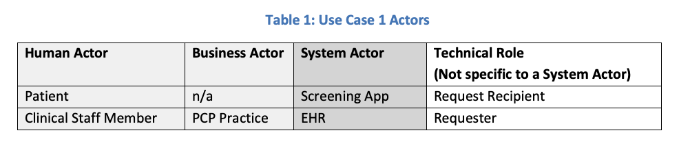
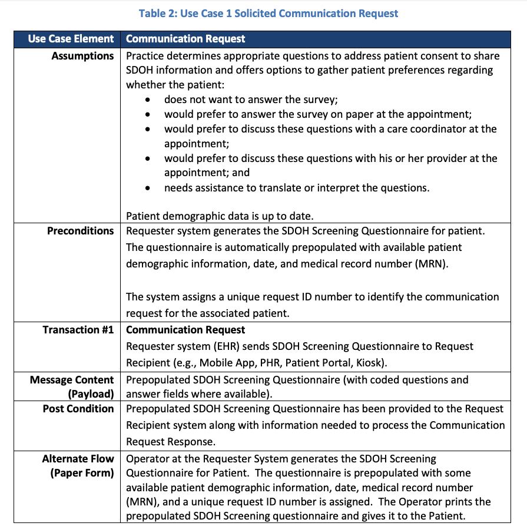
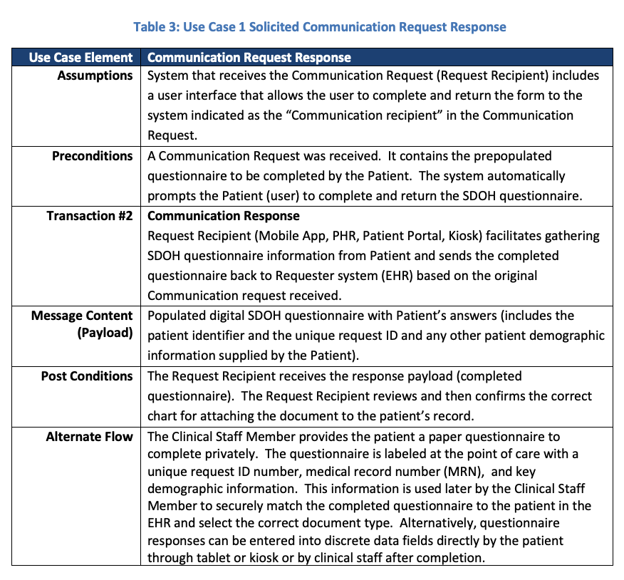
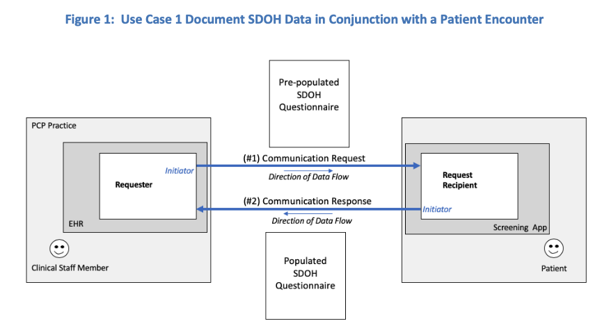
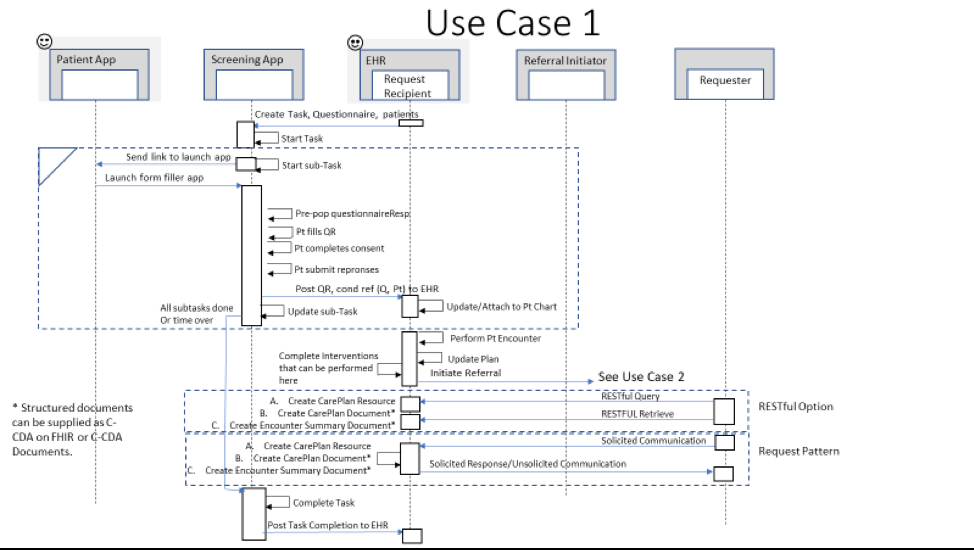

[Previous Page](toc.html)

This use case is relevant to how coded SDOH data are captured in a health care system and how data are shared with other systems.  SDOH data are documented either as part of screening or assessment/ diagnosis activities and may be the reason for ordering care activities. 

Transactions: 
1.	Solicited Communication Request
2.	Solicited Communication Request Response

<table><tr><td></td></tr></table>

<table><tr><td></td></tr></table>

<table><tr><td></td></tr></table>

<table><tr><td></td></tr></table>

<table><tr><td></td></tr></table>

## Use Case 1, Part 1
In Use Case 1, part 1, the EHR system initiates the task to request screening information be collected from a patient.  The EHR system selects the screening form to be used and supplies patient information for the list of patients to be screened by a certain data. The Screening App system receives the task and executes a sub-task for each patient, notifying the person at their selected telecom address, prepopulating the questionnaireResponse, and collected the completed questionnaireResponse. The Patient App can be a mobile app that interacts as a client to the Screening App system, or it can be a simple e-mail client with browser capabilities to launch a link supplied to email.

As each questionnaireResponse is completed, the Screening App forwards the completed QuestionnaireResponse to the task requester (EHR App). The EHR App attaches the received QuestionnaireResponse to the appropriate patient record and allows the user to view the screening results that were received. As each sub-task is completed, the Screening App updates the progress for the larger task.  If the deadline for the Task runs out, or when all sub-tasks are completed, the Screening App notifies the system that initiated the task of the completion. The system that initiated the task can query the Screening App to gather statistics about the task that was completed (number of sub-tasks initiated, number completed successfully, number started by not completed, number not completed.)

## Use Case 1, Part 2
In Use Case 1 part 2, the EHR App allows the user to gather other SDOH related information during the course of the clinical visit.  The practitioner can record a Clinical Assessment Observation, for example to indicate if Food Insecurity is present or absent, based on the screening information and other information gained during the patient encounter. The practitioner determines if the patient agrees there is a problem (condition) or risk of a problem regarding, for example Food Insecurity which the patient would like to see addressed.  The condition or risk can be added to the patients Problem List or noted as a Health Concern that should be tracked and addressed.  A care plan to address the condition or risk can be established by identifying a goal and the interventions that can be completed to make progress toward that goal. The Practitioner can document the planned interventions and any that are performed, or referred to be performed by a different organization. The interventions demonstrated initially in this use case are relevant to addressing SDOH Food Insecurity. At a subsequent visit, the practitioner can record if planned interventions had been completed based on responses received to earlier service requests, or based on information provided by the patient.  After each visit, the EHR system can provide a summary of the patient encounter or a snapshot of the care plan established to address the patients conditions/needs.  Outside systems can query for the care plan data or the encounter or care plan documents. Alternatively, outside systems can request to have this information sent to them, and the EHR system can respond to those requests, or send the data or document to a systems that has subscribed to the information, or has a business agreement to receive the information.  

## Use Case 1, Part 3
In Use Case 1, part 3, an outside systems queries for or requests information to be communicated from the clinical setting. Two options are supported. First, FHIR RESTful mechanisms can be used to query and retrieve the relevant data or documents.  Second, a solicited communication pattern can be used to request and receive the data or encounter documents, or an unsolicited communication can be used to send the documents to a known recipient.

[Next Page](Use_Case_2.html)